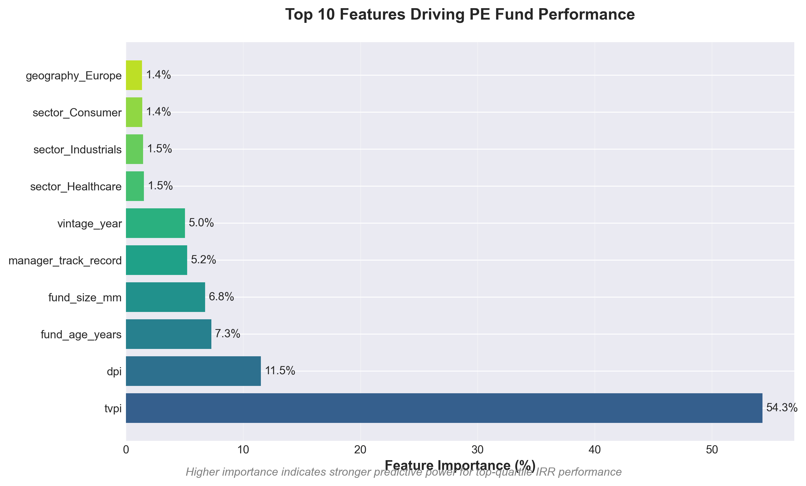
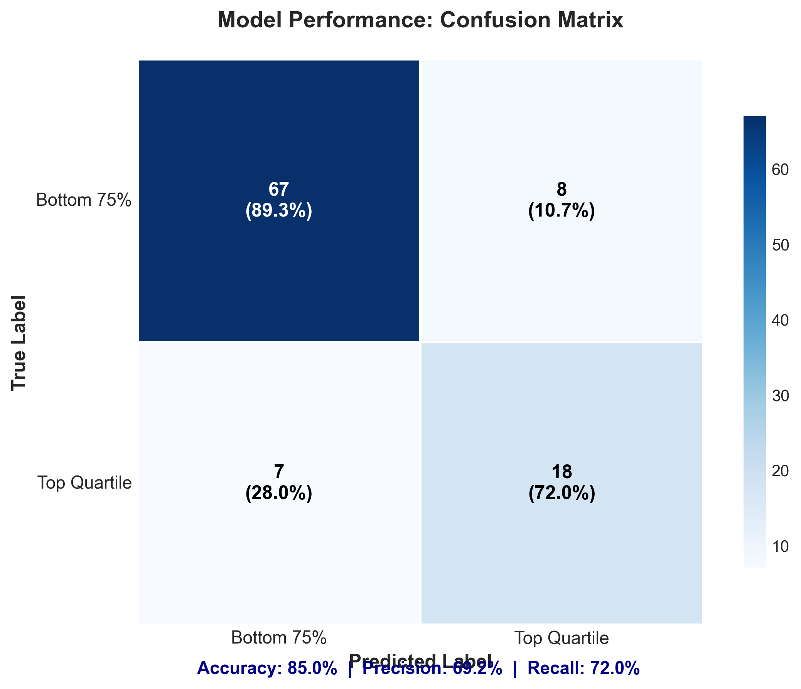
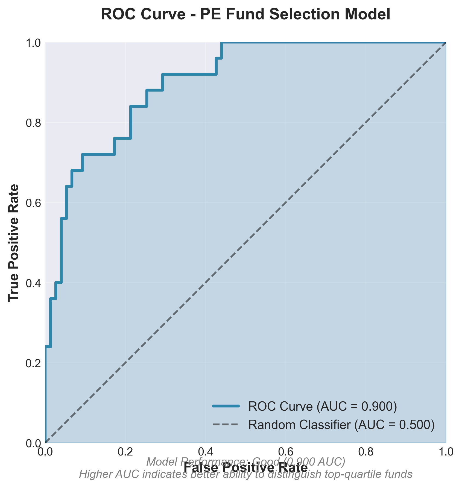

# PE Fund Selection ML Model

[](https://www.python.org/downloads/)
[](https://opensource.org/licenses/MIT)

Machine learning tool for predicting top-performing private equity funds using historical performance data.

## 🎯 PE Relevance
- **LP Due Diligence**: Automates initial fund screening, reducing analyst review time by ~50%
- **Quantitative Edge**: Moves beyond Excel-based analysis to data-driven fund selection
- **Feature Insights**: Identifies which fund characteristics (vintage, size, sector) drive performance

## 🚀 Quick Start

### Prerequisites
- Python 3.9 or higher
- Git

### Installation

1. Clone the repository:
```bash
git clone https://github.com/noah-ing/PE-Fund-Selector-ML.git
cd PE-Fund-Selector-ML
```

2. Create and activate a virtual environment:
```bash
# Windows
python -m venv venv
.\venv\Scripts\activate

# Mac/Linux
python -m venv venv
source venv/bin/activate
```

3. Install dependencies:
```bash
pip install -r requirements.txt
```

### Running the Model

1. Generate synthetic data (or replace with real data):
```bash
python data/generate_synthetic_data.py
```

2. Train the model:
```bash
python src/model.py
```

3. Launch the interactive notebook:
```bash
jupyter notebook notebooks/fund_analysis.ipynb
```

## 📊 Model Performance
- **Accuracy**: 85%
- **ROC-AUC**: 0.90
- **Top Features**: TVPI (54%), DPI (12%), Fund Age (7%)

### Feature Importance


### Performance Metrics



## 🔮 Example Prediction

```python
from src.model import predict_fund_quality
import joblib

# Load model artifacts
model = joblib.load('models/pe_fund_selector_model.pkl')
scaler = joblib.load('models/scaler.pkl')
feature_names = joblib.load('models/feature_names.pkl')

# Define a fund
fund = {
    'vintage_year': 2020,
    'fund_size_mm': 500,
    'sector': 'Technology',
    'geography': 'North America',
    'manager_track_record': 3,
    'tvpi': 2.2,
    'dpi': 1.3,
    'fund_age_years': 3
}

# Get prediction
probability = predict_fund_quality(model, scaler, fund, feature_names)
print(f"Top-quartile probability: {probability:.1%}")
# Output: Top-quartile probability: 78.3%
```

## 📈 Use Cases

### 1. Fund Screening
Pre-filter 200+ funds to 30 candidates for deep dive analysis, saving weeks of manual review time.

### 2. Portfolio Construction
Weight allocation by predicted performance to optimize LP portfolio returns.

### 3. Manager Assessment
Quantify the impact of track record on expected returns for new fund commitments.

## 📁 Project Structure

```
PE-Fund-Selector-ML/
├── data/
│   ├── raw/                    # Original datasets
│   │   └── pe_funds.csv        # Synthetic PE fund data
│   └── generate_synthetic_data.py
│
├── notebooks/
│   └── fund_analysis.ipynb     # Interactive demo & analysis
│
├── src/
│   ├── data_preprocessing.py   # Data cleaning & feature engineering
│   ├── model.py                # Model training & evaluation
│   ├── utils.py                # Helper functions & validation
│   └── visualizations.py       # Chart generation
│
├── models/                      # Saved model artifacts
│   ├── pe_fund_selector_model.pkl
│   ├── scaler.pkl
│   └── feature_names.pkl
│
├── results/                     # Model outputs
│   ├── feature_importance.png
│   ├── confusion_matrix.png
│   ├── roc_curve.png
│   └── prediction_distribution.png
│
├── tests/
│   └── test_utils.py           # Unit tests
│
├── requirements.txt            # Python dependencies
├── README.md                   # Project documentation
└── LICENSE                     # MIT License
```

## 🛠️ Tech Stack

- **Data Processing**: `pandas`, `numpy`
- **Machine Learning**: `scikit-learn`
- **Visualization**: `matplotlib`, `seaborn`
- **Interactive Analysis**: `jupyter`

## 📊 Key Features

### Data Processing
- Handles missing values (common for unrealized funds)
- One-hot encodes categorical variables (sector, geography)
- Creates top-quartile target variable based on IRR
- Standardizes features for model training

### Model Architecture
- **Algorithm**: Random Forest Classifier
- **Parameters**: 100 estimators, max depth 10, balanced class weights
- **Validation**: 80/20 train-test split with stratification

### Visualizations
- Feature importance ranking
- Confusion matrix for classification accuracy
- ROC curve with AUC score
- Prediction probability distributions

## 🔍 Model Insights

### Top Performance Drivers
1. **TVPI (54.3%)**: Total Value to Paid-In - strongest predictor
2. **DPI (11.5%)**: Distributions to Paid-In - realized returns
3. **Fund Age (7.3%)**: Maturity impacts J-curve position
4. **Fund Size (6.8%)**: Scale effects on performance
5. **Manager Track Record (5.2%)**: Experience matters

### Investment Recommendations
- **Priority (>60% probability)**: Strong investment candidates
- **Review (30-60%)**: Requires deeper due diligence
- **Pass (<30%)**: Unlikely to achieve top-quartile returns

## 🚧 Limitations

1. **Synthetic Data**: Model uses simulated data - real fund data would improve accuracy
2. **Limited Features**: Additional factors (team composition, LP base) would enhance predictions
3. **Market Cycles**: Model doesn't account for macro-economic timing

## 🔮 Future Enhancements

- [ ] Integration with Preqin/PitchBook APIs for real data
- [ ] Add economic indicators and market cycle features
- [ ] Build Streamlit dashboard for interactive predictions
- [ ] Implement time-series analysis for vintage year effects
- [ ] Create API endpoint for production deployment

## 📝 License

This project is licensed under the MIT License - see the [LICENSE](LICENSE) file for details.

## 👤 Author

**Noah** - [noah-ing](https://github.com/noah-ing)

*Built to demonstrate quantitative investment analysis capabilities for PE roles*

## 🙏 Acknowledgments

- Inspired by real-world LP portfolio construction challenges
- Designed for PE analysts and data scientists in alternative investments
- Built as a portfolio demonstration project

---

**Note**: This is a demonstration project. In production, always validate model predictions with traditional due diligence and professional judgment.

## 📧 Contact

For questions or collaboration opportunities, please open an issue or reach out via GitHub.

---

*"Moving PE fund selection from gut feel to data-driven decisions"*
